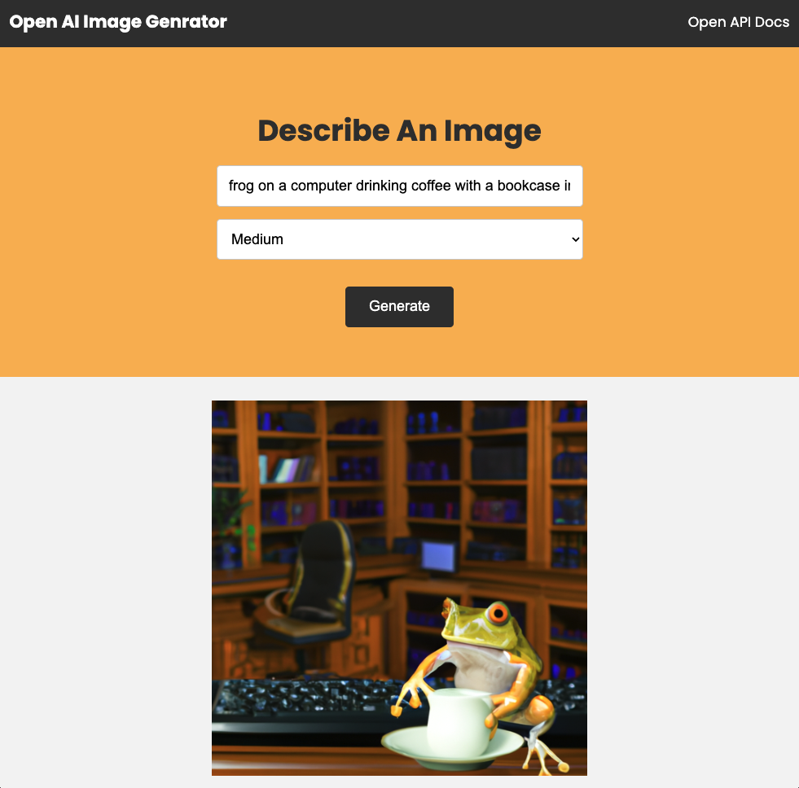

<!-- Banner Section -->

# 🛠️ Open AI Image Generator

<!--  -->

<!-- link to project -->
    <a href='-URL TO DEMO GOES HERE-'>
    <!-- link to local image -->
        
    </a>

**Link to project:** http://recruiters-love-seeing-live-demos.com/
 
 

Write a short sentence or two about this project and what it does. Be sure to include a link and a screenshot (we're front end devs so we can actually see our work!)..

## How It's Made:

**Tech used:** HTML, CSS, JavaScript, Framework of choice.

This application was created using HTML5, CSS3, JavaScript, Nodejs, Express, and Vite. HTML5 was used to create the structure of the application and provide basic styling. CSS3 was used to add more styling and make the application look more visually appealing. JavaScript was used to add interactivity and functionality to the application. Nodejs was used to create a server-side environment for the application. Express was used to handle routing and requests from the client-side.
 

  

 

<!-- 

  

 -->

<!-- &nbsp;
&nbsp;&nbsp;
&nbsp;&nbsp; -->

## Optimizations

_(optional)_

Future plans are to optimize the code by using the built-in features of **Vite**. It uses a build system that is based on Rollup, which allows for faster builds and smaller bundle sizes. Additionally, **Vite** provides a dev server with built-in hot module replacement (HMR) support, which enables developers to make changes to their code and see the results in real time without having to restart the server. Finally, **Vite** also offers tree shaking and code splitting. This will help reduce the size of the application and improve its performance. 

Convert this application to use **Vite** by running the following command in your terminal: 
> vite convert my-project

## Lessons Learned:

No matter what your experience level, being an engineer means continuously learning. Every time you build something you always have those _whoa this is awesome_ or _fuck yeah I did it!_ moments. This is where you should share those moments! Recruiters and interviewers love to see that you're self-aware and passionate about growing.

## Examples:

Take a look at these couple examples that I have in my own portfolio:

**Palettable:** https://github.com/alecortega/palettable

**Twitter Battle:** https://github.com/alecortega/twitter-battle

**Patch Panel:** https://github.com/alecortega/patch-panel

**Patch Panel:** https://github.com/alecortega/patch-panel
